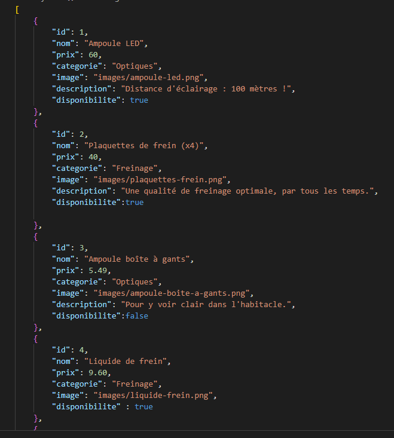
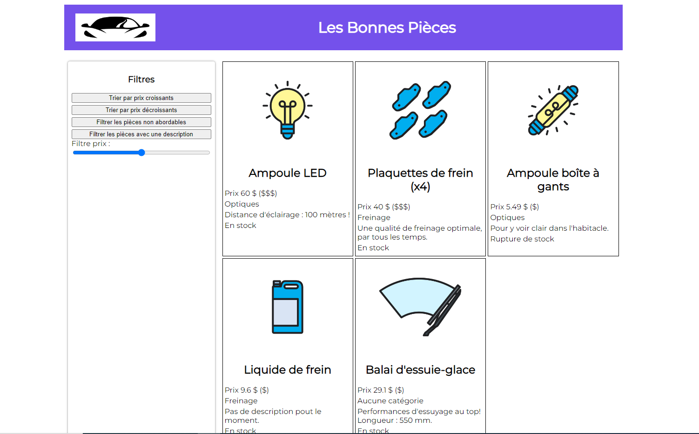
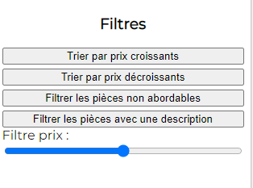
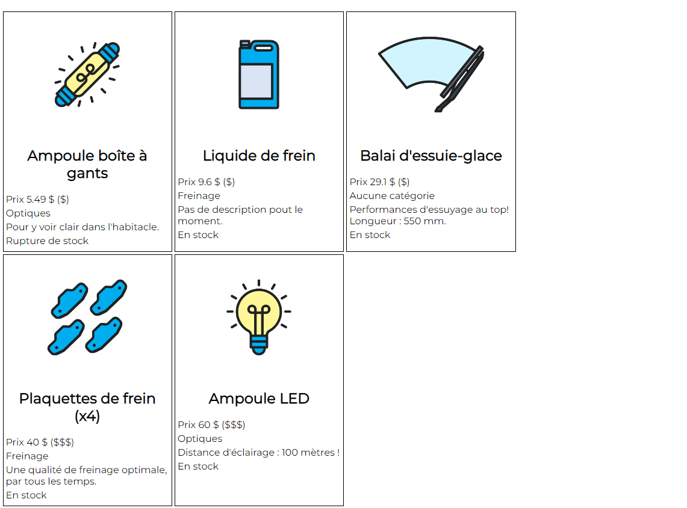
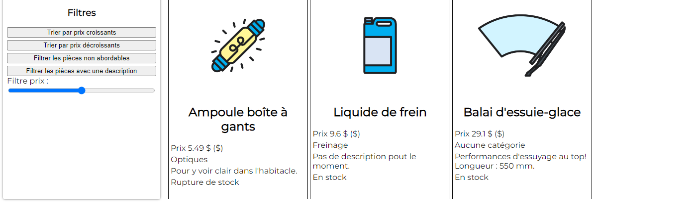
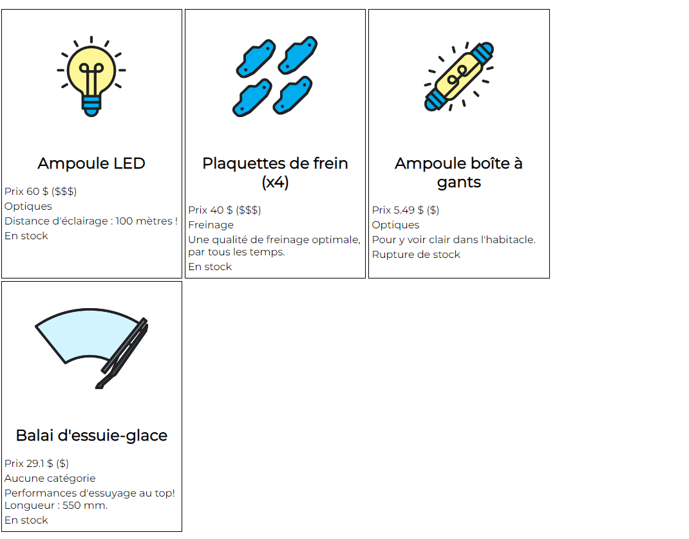
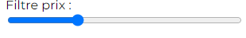
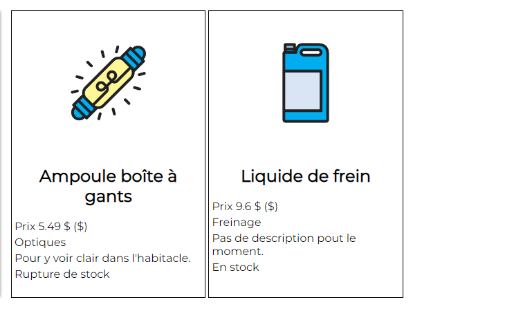
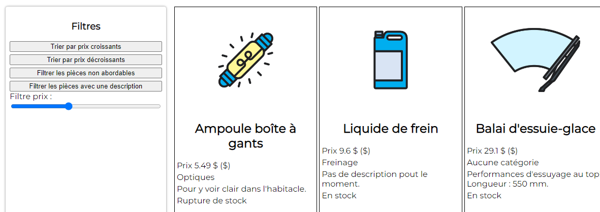

# Les-Bonnes-Pièces

## <u> Projet Javascript/NodeJs de Open Classroom </u> :

### Contexte :

  Un concessionnaire automobile, décident de mettre ses produits en ligne.

  Création d'un site web marchand dynamique.
  
  Les produits du site, ont été préalablement crée dans un fichier Json.
  
## L'objectif :

  1. Récupérer les données d'un fichier Json. 
  2. Exploiter/Manipuler ces données.
  3. Prise en main de NodeJS, Npm et Npx.

Le fichier Json, qui contient les différentes informations des produits :

L'index se présente de cette façon :

Différents filtres ont été ajoutés :

tri par prix croissants :

tri par prix décroissants :

Filtrer les pièces qui ont des prix non abordables inférieur ou égal à 35 € :

Filtrer les pièces qui ont une description :

Ce range permet de filtrer les produits en fonction de leur prix :

filtrer les pièces qui ont un prix inférieur à 10$ :

filtrer les pièces qui ont un prix inférieur à 40$ :

